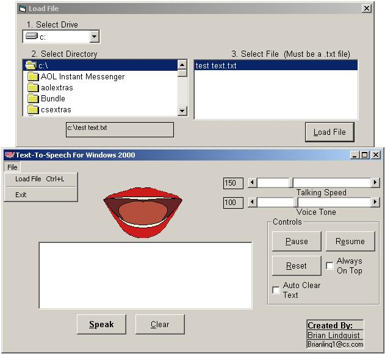



## TEXT TO SPEECH \*UPDATE\*

### Description

This is a text to speech program that allows you to type in text/load text files and have the voice repeat it, you can also copy/paste say news articles, emails, etc., you can also alter the way the voice sounds. NOTE: This only works with Windows 2000. From past feedback it sounds like windows NT & XP aren't compatible with this :( This requires XVOICE.DLL. if you don't have the DLL i've just posted the XVOICE.DLL file on the net.

ftp://65.108.102.55/pub/Xvoice.zip

the link IS case sensitive.
 
### More Info
 

             |
---                |---
**Submitted On**   |2003-03-31 16:35:48
**By**             |[Brian Lindquist](https://github.com/Planet-Source-Code/PSCIndex/blob/master/ByAuthor/brian-lindquist.md)
**Level**          |Intermediate
**User Rating**    |4.7 (14 globes from 3 users)
**Compatibility**  |VB 6\.0
**Category**       |[Complete Applications](https://github.com/Planet-Source-Code/PSCIndex/blob/master/ByCategory/complete-applications__1-27.md)
**World**          |[Visual Basic](https://github.com/Planet-Source-Code/PSCIndex/blob/master/ByWorld/visual-basic.md)
**Archive File**   |[TEXT\_TO\_SP1566933312003\.zip](https://github.com/Planet-Source-Code/brian-lindquist-text-to-speech-update__1-44325/archive/master.zip)

